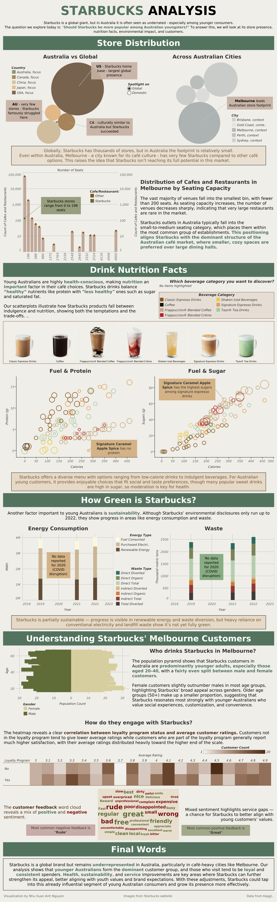

# Starbucks in Australia — A Data Story

An interactive data-storytelling infographic investigating Starbucks' underrated position in the Australian market — examining its store presence, drink nutrition, sustainability, and customers to ask whether it should appeal more to younger Australians. Built in **Tableau** for **FIT3179 Data Visualisation** at Monash University.

🔗 **[View the interactive infographic on Tableau Public »](https://public.tableau.com/app/profile/nhu.xuan.anh.nguyen/viz/StarbucksAnalysis-FIT3179Assignment1/Dashboard1)**

---

## Overview

Starbucks is a global giant, but in Australia it's often seen as underrated — especially among younger consumers. This piece is a top-to-bottom **visual narrative** built around one guiding question: **"Should Starbucks be more popular among Australian youngsters?"**

Rather than a monitoring dashboard, it's designed as an infographic story — each section builds an argument, moving through four lenses (**store presence, nutrition, environmental impact, and customers**) toward a conclusion about where Starbucks could better align with young Australian values and grow its footprint.



---

## The Narrative

**1 · Store Distribution — is Starbucks under-present in Australia?**
Proportional-symbol charts compare Starbucks' footprint across countries (US home-base dominance vs. Australia's famously small presence) and across Australian cities (Melbourne leading). A seating-capacity distribution then places Starbucks within Melbourne's café market, showing it fits the dominant small-to-medium, cozy-café structure Australians prefer over large dining halls.

**2 · Drink Nutrition Facts — indulgence vs health.**
Two scatterplots (Calories vs Protein, Calories vs Sugar) map every drink between "fuel," protein, and sugar, with an interactive beverage-category selector. The takeaway for health-conscious young Australians: the menu spans low-calorie to indulgent, but many popular sweet drinks are high in sugar — moderation is key.

**3 · How Green is Starbucks? — sustainability signals.**
Energy-consumption and waste charts (2018–2023, with the 2020 COVID data gap noted) show partial progress — visible gains in renewable energy and waste diversion, but continued reliance on conventional electricity and landfill.

**4 · Melbourne Customers — who drinks Starbucks, and how do they feel?**
A population pyramid reveals a customer base skewed toward younger adults (20–40), fairly even across genders. A heatmap links loyalty-program membership to higher average ratings, and a sentiment word cloud surfaces the mix of positive ("great," "friendly") and negative ("rude," "overpriced") feedback — flagging service gaps.

**Final Words** tie the four threads together into a recommendation: young Australians are already Starbucks' core audience, and health, sustainability, and service improvements are where it could deepen that appeal.

---

## Key Insights

- **Starbucks is under-present in Australia** — a tiny footprint relative to its global scale, and even in café-loving Melbourne it trails local options, suggesting untapped potential.
- **It fits the market structure it's in** — Starbucks' small-to-medium store format matches the dominant Australian café type, so positioning isn't the barrier.
- **Sweet drinks are the health trade-off** — the menu offers healthy options, but signature drinks (e.g. Caramel Apple Spice) rank highest in sugar, relevant to health-conscious young consumers.
- **Loyalty drives satisfaction** — loyalty-program members rate their experience markedly higher than non-members.
- **Young Australians are the core audience** — customers skew 20–40, loyal, and consistent spenders — an influential segment Starbucks could grow with the right improvements.

---

## Design Approach

This project is a **data-storytelling infographic**, not a dashboard — the emphasis is on visual narrative: a guiding question, a logical section flow, annotation that interprets each chart, and a concluding argument. Chart types were chosen to match each question rather than to fill a grid:

Proportional-symbol comparison charts · histogram (seating capacity) · interactive scatterplots with category highlighting · time-series bar charts · population pyramid · heatmap · word cloud.

---

## Tools

| Purpose | Tool |
|---------|------|
| Visualisation & storytelling | Tableau (Tableau Public) |
| Context | FIT3179 Data Visualisation, Monash University |

---

## Data Sources

- Starbucks store locations, drink nutrition, and sustainability data (Kaggle)
- Melbourne café/restaurant seating data
- Customer demographic and feedback data
- Product images from the Starbucks website

*(See the infographic footer for full source attribution.)*

---

## Files

```
starbucks-infographic-tableau/
├── README.md
├── images/
│   └── dashboard.png            # full infographic screenshot
├── Dashboard_1.pdf              # PDF export of the data story
└── Starbucks-Analysis.twbx      # packaged Tableau workbook (optional)
```

---

## How to View

- **Easiest:** open the [live version on Tableau Public](https://public.tableau.com/app/profile/nhu.xuan.anh.nguyen/viz/StarbucksAnalysis-FIT3179Assignment1/Dashboard1) — fully interactive, no install needed.
- **Static view:** see `Dashboard_1.pdf` in this repository.
- **To open the workbook:** download the `.twbx` and open it in Tableau Desktop or the free Tableau Reader.

---

*A data-storytelling infographic by Nhu Xuan Anh Nguyen — built in Tableau for FIT3179 Data Visualisation, Monash University.*
